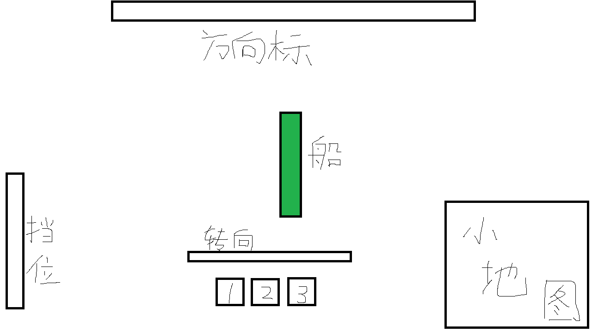

# Hopeless Cactus V

Hopeless Cactus 系列第五弹！

## 游戏说明

操控你的战舰，用鼠标发射导弹或鱼雷击溃敌人！

## 客户端

使用 Cocos Creator

界面大致如下



上方方向标标示当前朝向

左下方是标示速度的挡位

右下角一个小地图

下方可切换准备使用的武器

武器栏上方是标示转向的挡位

其余部分是游戏画面，自机显示在中央

### 操作

玩家可通过 WS 调整速度挡位，前进 4 挡后退 1 挡

玩家可通过 AD 调整转向挡位，两个方向各有 2 挡

玩家可通过鼠标滚轮/双指缩放调整视野

玩家可通过点击界面下方武器栏或使用快捷键调整武器并使用鼠标发射

武器有冷却时间限制，部分武器可积攒（如导弹）

玩家的视野取决于雷达，雷达探测范围外的所有东西无法被玩家看到，玩家只能看到探测范围内的敌舰、导弹和鱼雷等

### 船的属性

```plain
radar: 雷达半径
accelerationV: 最大加速度
accelerationA: 最大角加速度
currentVelocity: 当前速度
currentAngularVelocity: 当前角速度
currentGearV: 当前速度挡位 ( 值域 [-1, 4] )
currentGearA: 当前角度挡位 ( 值域 [-2, 2] )
currentX: 当前 x 坐标
currentY: 当前 y 坐标
currentAngle: 当前角度
```

## 服务端

使用 Colyseus

## 通信

opt 结构如下所示：

```json
{
    "addPlayer": false,
    "random_X": 0,
    "random_Y": 0,
    "currentGearV": 0,
    "currentGearA": 0,
    "attack": {
        "type": 1,
        "target": {
            "x": 0,
            "y": 0
        }
    }
}
```

### 客户端 向 服务端

客户端向服务端发送如下 message：

```json
{
    "type": "a",
    "content":

    "opt"
}

{
    "type": "g",
    "content":

    [
        "from_frame_index",
        "end_frame_index"
    ]
}

{
    "type": "n",
    "content":

    "num"
}
```

当 type 为 a 时，表明玩家进行了操作，后面为玩家的操作

当 type 为 g 时，表明玩家向服务器请求一段操作序列

当 type 为 n 时，表明玩家刚进入房间，当 num 为 0 时表明请求所有操作，为 1 时表明玩家已追帧完毕，请求服务器广播

### 服务端 向 客户端

服务端向客户端发送如下 message：

```json
{
    "type": "f/n",
    "content":

    [
        [
            "frame_index1",
            [
                "random_seed1",
                [
                    "sessionId1",
                    "opt"
                ],
                [
                    "sessionId2",
                    "opt"
                ]
            ]
        ],
        [
            "frame_index2",
            [
                "random_seed2",
                [
                    "sessionId1",
                    "opt"
                ],
                [
                    "sessionId2",
                    "opt"
                ]
            ]
        ]
    ]
}
```

frame_index 为操作发生的帧序号

sessionId 为进行操作的玩家会话编号